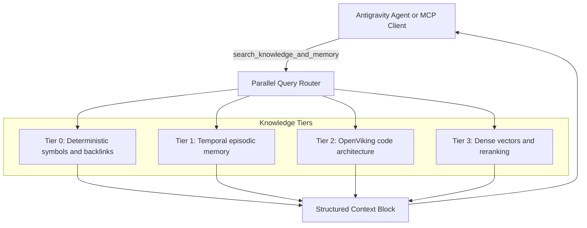

# Cortex

> Four-tier memory, AST code intelligence, and RAG system for Google Antigravity CLI

[](LICENSE)
[](pyproject.toml)
[](https://github.com/jlowin/fastmcp)
[](https://qdrant.tech/)
[](https://falkordb.com/)

Cortex is a persistent memory and code intelligence system for the Google Antigravity CLI (`agy`) and AI coding agents. It pairs deterministic AST graphs and temporal episodic records with dense vector search. Everything runs locally without cloud dependencies.

---

## Documentation index

Detailed guides live in [`docs/`](docs/):

| Document | Description |
| :--- | :--- |
| [System architecture](docs/architecture.md) | Four-tier memory design, query routing, and local service topology. |
| [FastMCP tools reference](docs/mcp_tools.md) | Tool arguments, schemas, Cypher traversal queries, and agent protocols. |
| [Hierarchical AST chunking](docs/chunking_and_ast.md) | Code parser, skeleton chunks, 10 Tree-sitter grammars, Markdown links, and SCIP. |
| [OpenViking dynamic watching](docs/watcher_and_viking.md) | Incremental file sync in under 5ms, cache eviction, and workspace switching. |
| [Web dashboard](docs/dashboard.md) | Network graph view, symbol impact tree, and service metrics. |
| [Antigravity integration](docs/antigravity_integration.md) | Lifecycle hooks, watcher sidecar, subagents, and skills. |
| [Cognitive dream mode](docs/cognitive_dream_mode.md) | Fact pruning, Louvain community detection, and invariant generation. |
| [Operations and setup](docs/operations_and_setup.md) | Hardware setups across CUDA, ROCm, Metal, and CPU, plus container commands. |

---

## Four-tier memory architecture

Cortex divides codebase context into four layers, starting from exact syntax trees down to text vectors:



| Tier | Source | Precedence | Description |
| :--- | :--- | :--- | :--- |
| Tier 0: AST symbols | FalkorDB `cortex_symbols` | Ground truth | Symbol declarations, definitions, and cross-file callers across 10 programming languages and Markdown vaults. |
| Tier 1: Episodic facts | FalkorDB `cortex` | High | Decisions, bug fixes, configuration states, and invariants. Overrides model assumptions. |
| Tier 2: Code structure | OpenViking Tree-sitter AST | Medium-high | Module docstrings and class or function signatures. Syncs on file changes in under 5ms. |
| Tier 3: Code references | Qdrant + Reranker | Medium | Dense vector search across code chunks. Falls back to vector scores if no reranker runs. |

---

## Quick start

### 1. Requirements
- Docker Desktop or Docker Engine (runs FalkorDB and Qdrant)
- Python 3.11 or newer
- `uv` package manager
- Google Antigravity CLI (`agy`)

### 2. Setup

```bash
cd cortex
make setup
```

### 3. Start services

```bash
make start
make status
```

### 4. Install into Antigravity

```bash
make plugin-install
```

---

## FastMCP tools reference

Cortex runs 7 tools over stdio:

### `search_knowledge_and_memory(prompt, collection=None, workspace_root=None)`
Runs the four-tier search across all graphs and vector collections. Call this before drafting code edits.
```python
search_knowledge_and_memory("How is symbol blast radius computed?")
```

### `trace_symbol_impact(symbol, direction='upstream', max_depth=3)`
Traverses symbol graph edges (`DEFINED_IN`, `REFERENCES`, `IMPORTS`, `IMPLEMENTS`) to find affected callers or dependencies. Call this before renaming or deleting symbols.
```python
trace_symbol_impact(symbol="SymbolGraphManager", direction="upstream")
```

### `record_system_outcome(episode_name, content, tags=None, project='cortex', entities=None, facts=None, supersedes=None)`
Writes decisions, bug fixes, and milestones to FalkorDB and appends them to the daily markdown journal.
```python
record_system_outcome(
    episode_name="Enabled dynamic workspace watching in OpenViking",
    content="Wired sync_file and delete_file directly into file watcher.",
    tags=["viking", "watcher", "refactor"],
    project="cortex"
)
```

### `trigger_dream_mode(project='cortex', purge_stale=False)`
Prunes superseded facts, computes Louvain graph communities, and writes updated rules to `journal/invariants.md`.

### `index_directory(path, collection=None)`
Splits files into syntax-aware chunks with preamble headers and stores them in Qdrant.

### `check_cortex_health()`
Pings FalkorDB, Qdrant, the inference endpoint, and the dashboard, returning statuses and fix steps.

### `delete_or_supersede_fact(fact_id, reason)`
Marks an existing knowledge graph fact as invalid while keeping the audit trail intact.

---

## Antigravity integration

Cortex connects to the Antigravity runtime through four mechanisms:

- **Lifecycle hooks** (`scripts/hooks/`):
  - `PreInvocation`: Injects active invariants and health status on turn 0 and gives periodic reminders.
  - `PreToolUse`: Blocks destructive shell commands such as `rm -rf /` or `git reset --hard`.
  - `PostToolUse`: Updates Qdrant, FalkorDB, and OpenViking right after the agent writes a file.
  - `Stop`: Checks that the agent saved an outcome if files were changed during the turn.
- **Watcher sidecar** (`integrations/antigravity/sidecars/`):
  Runs `cortex.watcher` under runtime supervision to track external file edits.
- **Subagents** (`integrations/antigravity/agents/`):
  - `cortex-researcher`: Read-only agent for searching memory and checking impact graphs without filling parent context.
  - `cortex-architect`: System refactoring agent that follows blast-radius verification steps.
- **Skills** (`integrations/antigravity/skills/`):
  - `/cortex-rag`: Command guide for querying memory and running re-indexing.
  - `/cortex-architect`: Command guide for blast-radius audits and community clustering.

---

## Web dashboard

Start the dashboard on port 8004:

```bash
make dashboard
```

Open `http://localhost:8004` to use:
- The 2D/3D force layout of episodic facts and symbol relationships.
- Symbol search with upstream and downstream impact trees.
- Live health indicators for databases, model servers, and the file watcher.
- A one-click button to trigger memory consolidation.

---

## Testing

Cortex maintains automated tests across all components:

```bash
make test
```

Individual test files:
```bash
uv run python3 scripts/test_dynamic_viking.py           # OpenViking sync and file deletions
uv run python3 scripts/test_ultimate_chunking.py        # AST parsing, skeletons, and statements
uv run python3 scripts/test_tier2_languages.py         # 10 Tree-sitter language parsers
uv run python3 scripts/test_scip_ingest.py              # SCIP protobuf parser and cross references
uv run python3 scripts/test_markdown_vault_ingestion.py # WikiLinks and bidirectional references
uv run python3 scripts/test_antigravity_hooks.py        # Pre-invocation, tool gate, and stop hooks
uv run python3 scripts/test_dashboard_enhancements.py   # Dashboard API endpoints
uv run python3 scripts/test_plugin_manifest.py         # Plugin schemas and sidecar configs
```

---

## Contributing

Review these guides before opening a pull request:

- [Contributing guide](CONTRIBUTING.md): Environment setup, branch names, and PR workflow.
- [Coding standards](CODING_STANDARDS.md): Type annotations, 1,000-line file caps, and performance limits.
- [Code of conduct](CODE_OF_CONDUCT.md): Community expectations.
- [Security policy](SECURITY.md): How to report vulnerabilities.

---

## License

Apache License, Version 2.0. See [LICENSE](LICENSE) for details.
