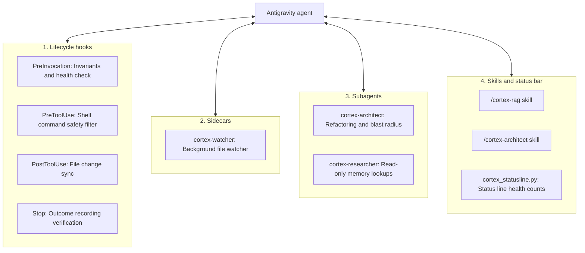

# Antigravity integration

This document covers the hooks, watcher sidecar, subagents, and skills connecting Cortex to Google Antigravity CLI.

---

## 1. Integration structure

Cortex connects to Antigravity through four components:



---

## 2. Lifecycle hooks (`scripts/hooks/`)

Hooks run external commands at defined steps during agent execution:

### `cortex-pre-invoke` (`PreInvocation`)
- **Script**: `scripts/hooks/hook_pre_invoke.py`
- **Behavior**:
  - Turn 0: Injects active invariants from `journal/invariants.md` and database health into the session prompt.
  - Every 10th turn: Adds a reminder to check memory and record outcomes.
  - Other turns: Exits with an empty JSON object.

### `cortex-safety-gate` (`PreToolUse`)
- **Script**: `scripts/hooks/hook_pre_tool.py`
- **Matcher**: `run_command|replace_file_content|write_to_file`
- **Behavior**:
  - Checks shell commands for destructive actions (`rm -rf /`, `rm -rf ~`, `git reset --hard`, `mkfs`).
  - Flagged commands return `decision: "ask"` to require user confirmation.
  - Other commands return `decision: "allow"`.

### `cortex-hot-sync` (`PostToolUse`)
- **Script**: `scripts/hooks/hook_post_tool.py`
- **Matcher**: `write_to_file|replace_file_content|multi_replace_file_content`
- **Behavior**:
  - Runs after the agent modifies a file.
  - Parses changed AST nodes and updates OpenViking, FalkorDB, and Qdrant in under 150ms.

### `cortex-stop-guard` (`Stop`)
- **Script**: `scripts/hooks/hook_stop.py`
- **Behavior**:
  - Runs when the agent attempts to stop.
  - Checks `transcript.jsonl`. If files were edited during the turn but `record_system_outcome` was not called, it returns `decision: "continue"` with a reminder.
  - If an outcome was recorded or no files were changed, it returns `decision: "stop"`.

---

## 3. Watcher sidecar

The watcher sidecar runs in the background under Antigravity supervision, configured in `integrations/antigravity/sidecars/cortex-watcher/sidecar.json`:

```json
{
  "name": "cortex-watcher",
  "command": "<cortex_root>/.venv/bin/python3",
  "args": [
    "-m", "cortex.watcher",
    "--watch", "<cortex_root>"
  ],
  "restart_policy": "always"
}
```

It monitors external file changes (such as edits from another editor or git branch switches) and updates FalkorDB and Qdrant.

---

## 4. Subagents

Defined in `integrations/antigravity/agents/`:

### `cortex-architect`
System refactoring agent that runs a five-step process:
1. Upstream impact analysis with `trace_symbol_impact`.
2. Historical decision lookups with `search_knowledge_and_memory`.
3. File modifications.
4. Outcome recording with `record_system_outcome`.
5. Invariant updates with `trigger_dream_mode`.

### `cortex-researcher`
Read-only research agent that queries memory and inspects symbol graphs without adding details to the primary conversation context.

---

## 5. Plugin installer (`scripts/install_plugin.py`)

Run `make plugin-install` to install Cortex into Antigravity:

```bash
make plugin-install
```

The script:
1. Detects the local repository path.
2. Generates `hooks.json` and `sidecar.json` referencing local script and virtual environment paths.
3. Links the plugin to `~/.gemini/antigravity-cli/plugins/cortex`.
4. Copies skills into `~/.gemini/config/skills/` and subagents into `~/.gemini/config/agents/`.
5. Sets executable permissions on hook scripts.
