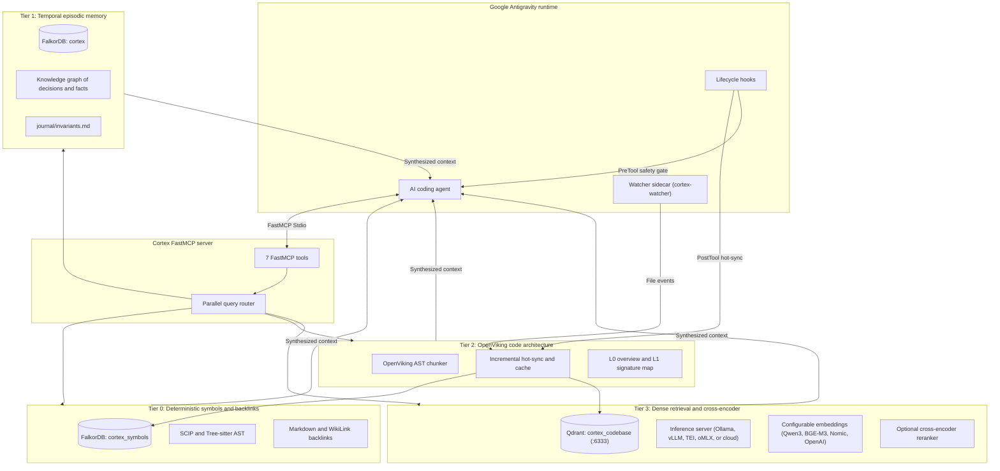
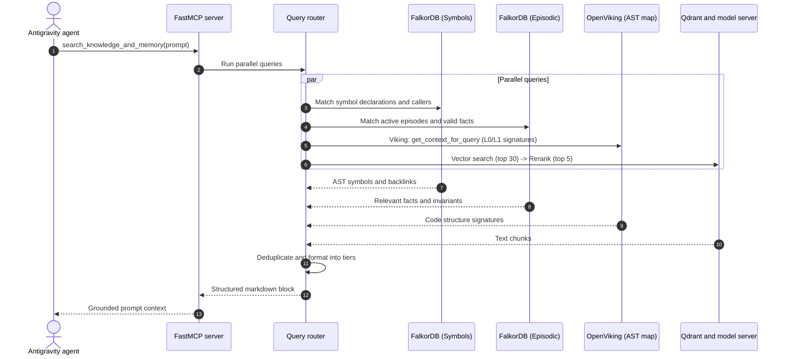
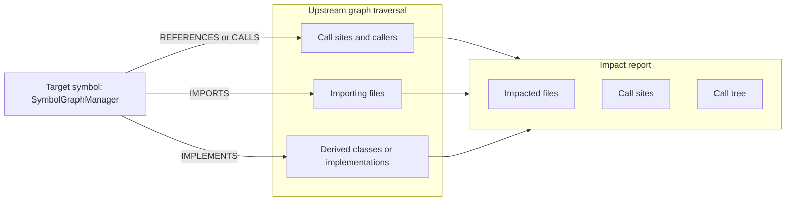

# Cortex system architecture

This document specifies the four-tier memory model, query routing pipeline, and local services for Cortex.

---

## 1. System design

AI coding agents face three recurring problems:
1. They forget architectural decisions and fixes from previous conversations.
2. Vector search often misses exact definitions, caller references, and interface implementations.
3. Adding full files into prompt context degrades performance and consumes tokens.

Cortex addresses these issues with four structured context tiers. It combines exact Abstract Syntax Tree (AST) graphs and temporal episodic records with dense vector search.

---

## 2. System topology

---

## 3. The four knowledge tiers

Context is structured into four layers:

| Tier | Subsystem | Storage engine | Precedence | Source mechanism |
| :--- | :--- | :--- | :--- | :--- |
| Tier 0 | Symbols and backlinks | FalkorDB (`cortex_symbols`) | Ground truth | AST symbol declarations, caller and callee cross-references, SCIP indices, and bidirectional WikiLinks. |
| Tier 1 | Operational facts | FalkorDB (`cortex`) | High | Temporal episodic graph storing architectural decisions, milestone notes, and active invariants. |
| Tier 2 | Code architecture | OpenViking Tree-sitter map | Medium-high | L0 module docstrings and L1 declaration signatures across 10 programming languages, updated on save in under 5ms. |
| Tier 3 | Code and documentation text | Qdrant + Reranker | Medium | Dense vector embeddings with cross-encoder reranking against source text chunks. |

---

### Tier 0: Symbols and backlinks (`cortex_symbols`)
Tier 0 contains deterministic code structure:
- **Language ASTs**: 10 Tree-sitter parsers covering Python, TypeScript, JavaScript, Rust, Go, C, C++, Java, Kotlin, Swift, and C#.
- **Graph nodes**: `Symbol`, `File`, `Module`, `WikiPage`.
- **Graph edges**:
  - `(:Symbol)-[:DEFINED_IN]->(:File)`
  - `(:Symbol)-[:REFERENCES]->(:Symbol)`
  - `(:Symbol)-[:CALLS]->(:Symbol)`
  - `(:Symbol)-[:IMPORTS]->(:Symbol)`
  - `(:Symbol)-[:IMPLEMENTS]->(:Symbol)`
  - `(:WikiPage)-[:LINKS_TO]->(:WikiPage)`
- **SCIP protocol**: Deserializes standard Source Code Intelligence Protocol protobuf indexes for multi-language definitions and references.

### Tier 1: Temporal episodic memory (`cortex`)
Tier 1 records engineering decisions across time:
- **Graph nodes**: `Episode`, `Entity`, `Fact`.
- **Episodic properties**: `name`, `content`, `timestamp`, `project`, `superseded_by`.
- **Temporal validity**: Older conflicting facts are preserved with `VALID_UNTIL` stamps and linked through `[:SUPERSEDES]` edges.
- **Invariants**: Rules induced from graph clusters are saved to `journal/invariants.md` and injected into the agent prompt at the start of a session.

### Tier 2: OpenViking code architecture
Tier 2 maintains an in-memory structural outline of the workspace:
- **L0 module overviews**: Top-level docstrings, exports, and module roles.
- **L1 signatures**: Function, class, and method signatures with parameter and return types, excluding function bodies.
- **Reactive hot-sync**: Updates in memory in under 5ms when files are added, modified, or removed.

### Tier 3: Dense retrieval and reranking
Tier 3 handles semantic text search across code chunks:
- **Embeddings**: Works with any OpenAI-compatible embedding endpoint (such as `Qwen3-Embedding-8B`, `BGE-M3`, `nomic-embed-text`, or `text-embedding-3-small`) and configurable vector dimensions.
- **Inference options**: Connects to local servers (vLLM, Ollama, TEI, oMLX) or cloud endpoints.
- **Vector database**: Qdrant running in Docker on port 6333 using cosine distance and HNSW indexing.
- **Cross-encoder reranking**: Re-scores top 30 candidates to select top 5 chunks. If no reranker is running, the pipeline falls back to vector scores.

---

## 4. Query execution lifecycle

When an agent invokes `search_knowledge_and_memory(prompt="...")`, the pipeline runs parallel lookups:

---

## 5. Blast-radius analysis

Before changing or deleting a shared class, function, or interface, the agent calls `trace_symbol_impact(symbol, direction='upstream', max_depth=3)`:

The traversal walks Cypher graph edges up to 5 hops, returning the list of files and lines that depend on the symbol.

---

## 6. Privacy and local operation

Cortex runs locally without requiring outside network calls:
- **Local inference**: Works on Apple Silicon (Metal), Linux/Windows (NVIDIA CUDA or AMD ROCm), or standard x86 and ARM CPUs.
- **Local databases**: Runs FalkorDB (port 6379) and Qdrant (port 6333) in local containers.
- **Session logs**: Kept in `~/.gemini/antigravity-cli/` and `<cortex_root>/journal/`.
- **Data boundary**: With local model runners, no source code, embeddings, or prompts leave the workstation.
