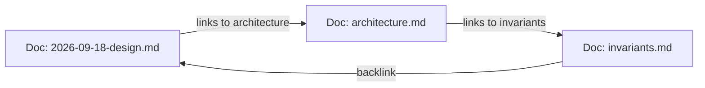

# Hierarchical AST chunking and symbol extraction

This document details the code chunking pipeline, Tree-sitter parsers, Markdown backlink handling, and SCIP index ingestion in Cortex.

---

## 1. Chunking pipeline overview

Chunking source code by raw character or token counts splits functions across arbitrary lines and loses enclosing class names and imports.

Cortex uses `SmartCodeNodeParser` to split code along syntax boundaries:

```mermaid
flowchart TD
    File["Source code, config, or markdown file"] --> Router{File router}
    
    Router -->|Code (10 languages)| ASTExtract["AST extractor"]
    Router -->|Configs (YAML/TOML/JSON)| ConfigSplit["Config splitter"]
    Router -->|Markdown / Obsidian| MDSplit["Markdown and WikiLink splitter"]
    Router -->|SCIP Protobuf (*.scip)| SCIPParser["SCIP ingestion"]

    ASTExtract --> Skeletons["1. Skeleton chunks (class overviews)"]
    ASTExtract --> Statements["2. Statement sliding window"]
    ASTExtract --> Coalesce["3. Short stub coalescing (<50 tokens)"]
    
    Skeletons & Statements & Coalesce --> ContextualPreamble["4. Contextual preamble injection"]
    ConfigSplit --> ContextualPreamble
    MDSplit --> ContextualPreamble
    
    ContextualPreamble --> EmbedVector["Embedding generation & Qdrant upsert"]
    ASTExtract --> FalkorSymbols[("FalkorDB symbol graph")]
    SCIPParser --> FalkorSymbols
```

---

## 2. Chunking strategies

### Skeleton chunks
When parsing classes or large modules, Cortex generates an outline chunk:
- Strips method bodies and retains signatures, docstrings, and type annotations.
- Matches queries against the structure of a class without truncating individual methods.

```python
# Generated skeleton chunk:
class SymbolGraphManager:
    """Manages FalkorDB symbol graph, SCIP ingestion, and blast-radius traversals."""
    def __init__(self, host: str, port: int, graph_name: str = "cortex_symbols"): ...
    def save_symbol(self, symbol: Symbol) -> None: ...
    def trace_impact(self, symbol_name: str, direction: str, max_depth: int) -> ImpactReport: ...
```

### Statement sliding window
When a function exceeds the chunk limit (such as 512 tokens):
- Splits occur on statement boundaries.
- Consecutive chunks share a 2-statement overlap to preserve local context.

### Short stub coalescing
Methods under 50 tokens (such as getters, setters, and delegates) merge into their neighboring function or parent class to avoid index fragmentation.

### Contextual preamble injection
Each chunk is prefixed with metadata before embedding:
```
File: cortex/symbols/graph.py
Enclosing Class: SymbolGraphManager
Path: cortex > symbols > graph > SymbolGraphManager > trace_impact
Language: python
---
[Code statements]
```

---

## 3. Supported programming languages

Cortex parses 10 languages using Tree-sitter grammars and Python AST:

| Language | Extensions | Parser | Extracted symbols |
| :--- | :--- | :--- | :--- |
| Python | `.py` | `ast` and Tree-sitter | Classes, functions, async defs, methods, imports |
| TypeScript / JavaScript | `.ts`, `.tsx`, `.js`, `.jsx` | Tree-sitter | Classes, functions, interfaces, arrow functions, exports |
| Rust | `.rs` | Tree-sitter | Structs, enums, traits, impl blocks, functions |
| Go | `.go` | Tree-sitter | Structs, interfaces, functions, methods, packages |
| C / C++ | `.c`, `.h`, `.cpp`, `.hpp`, `.cc` | Tree-sitter | Functions, structs, classes, namespaces |
| Java | `.java` | Tree-sitter | Classes, interfaces, enums, methods |
| Kotlin | `.kt`, `.kts` | Tree-sitter | Classes, objects, functions, interfaces |
| Swift | `.swift` | Tree-sitter | Structs, classes, protocols, extensions, functions |
| C# | `.cs` | Tree-sitter | Classes, interfaces, structs, methods, namespaces |

---

## 4. Markdown vaults and WikiLinks

Markdown files with cross-links (such as Obsidian vaults and design docs) index as graph nodes:



- **WikiLink extraction**: Matches `[[TargetPage]]` and `[[TargetPage|Alias]]`.
- **FalkorDB links**:
  `(:WikiPage {title: "2026-09-18-design"})-[:LINKS_TO]->(:WikiPage {title: "architecture"})`
- **Section headers**: Splits along markdown headers (`#`, `##`, `###`) while retaining section breadcrumbs.

---

## 5. SCIP index ingestion

For compiled codebases, Cortex ingests Source Code Intelligence Protocol (SCIP) index files:
- **Protobuf parsing**: Uses `cortex/symbols/scip_pb2.py` generated from `scip.proto`.
- **Definitions and call sites**: Stores exact character ranges for definitions, documentation strings, and references.
- **Inheritance**: Creates `[:IMPLEMENTS]` and `[:INHERITS]` edges in FalkorDB.
- **Idempotence**: Re-indexing updates existing records without creating duplicate nodes.
