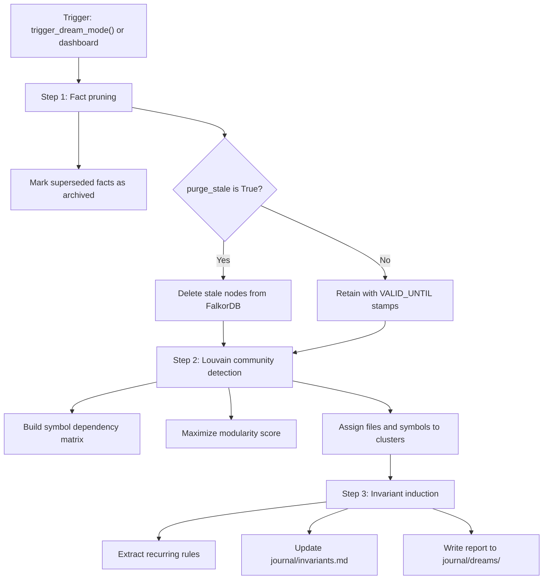

# Memory consolidation and dream mode

This document covers fact pruning, Louvain community clustering, and invariant induction in Cortex.

---

## 1. Overview

Over time, project knowledge accumulates conflicting facts and outdated rules. Dream mode (`cortex/dream.py`) cleans the graph:
- **Fact pruning**: Marks superseded facts as inactive or drops them if requested.
- **Subsystem clustering**: Partitions symbol and dependency graphs into functional modules using the Louvain community detection algorithm.
- **Invariant induction**: Updates recurring architectural rules in `journal/invariants.md`.

---

## 2. Consolidation steps

### Step 1: Fact pruning
- Queries FalkorDB episodic memory for facts with active `[:SUPERSEDES]` relationships.
- Resolves conflicts between older and newer entries.
- When `purge_stale=True`, removes old nodes from the database. When `False`, retains them with `VALID_UNTIL` timestamps for audit history.

### Step 2: Louvain community clustering
- Constructs an adjacency matrix from symbol relationships (`REFERENCES`, `CALLS`, `IMPORTS`).
- Runs the Louvain modularity optimization to find cohesive groups of files and functions.
- Groups code into clusters such as chunking, retrieval, and dashboard routing.

### Step 3: Invariant induction
- Evaluates recent outcomes and cluster boundaries to identify project rules.
- Writes active constraints to `journal/invariants.md`.
- Saves a summary report in `journal/dreams/YYYY-MM-DD-dream.md`.

---

## 3. Daily journal synchronization (`cortex/scripts/sync_journal.py`)

Cortex writes human-readable markdown logs:
- Calls to `record_system_outcome` append entries to `journal/YYYY-MM-DD.md`.
- `cortex/scripts/sync_journal.py` reads user additions from daily journal files and saves them into the FalkorDB episodic graph.
