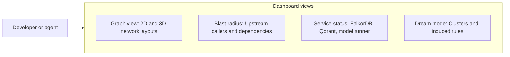

# Dashboard and graph visualization

This document covers the web dashboard on port 8004, the graph viewer, and the blast-radius tool.

---

## 1. Overview

The Cortex dashboard provides a web interface for graphs and service statuses:
- **Network graphs**: 2D and 3D layout of memory and symbol nodes using Vis.js.
- **Symbol impact inspection**: Look up any class or function to view upstream callers and downstream dependencies.
- **Service metrics**: Connectivity checks for FalkorDB, Qdrant, model servers, and the file watcher.
- **Cache stats**: Hit rates and memory use for chunk caches.
- **Memory consolidation**: Button to trigger Dream mode clustering and rule generation.

---

## 2. Launching the dashboard

Run from the repository root:

```bash
make dashboard
```

Open `http://localhost:8004` in a browser.

---

## 3. Interface features



### Graph visualizer
Switch between two graph views:
- **Episodic graph (`cortex`)**: Decisions, milestones, and facts linked by relationships such as `IMPLEMENTS`, `RESOLVES`, and `SUPERSEDES`.
- **Symbol graph (`cortex_symbols`)**: Functions, classes, and files linked by code relationships such as `DEFINED_IN`, `REFERENCES`, `CALLS`, and `IMPORTS`.

### Symbol blast-radius tool
- **Search bar**: Typeahead search for symbol names and file paths.
- **Upstream view**: Displays all call sites that depend on the chosen symbol.
- **Downstream view**: Displays functions and modules called by the chosen symbol.
- **Impact tree**: Structured tree showing hop depth and file locations.

### Service status
Displays:
- **FalkorDB**: Port 6379, node and edge counts, and query round-trip time.
- **Qdrant**: Port 6333, collection names, and stored vector counts.
- **Inference server**: Status of the configured embedding and reranker endpoints.
- **Watcher**: Active watch path, debounce interval, and file sync count.

---

## 4. API endpoints

The dashboard serves JSON endpoints for automation:

| Endpoint | Method | Query parameters | Description |
| :--- | :--- | :--- | :--- |
| `/` | `GET` | None | Serves the single-page application. |
| `/api/graph` | `GET` | `graph=cortex\|cortex_symbols`, `limit=500` | Returns nodes and edges formatted for Vis.js. |
| `/api/symbols/autocomplete` | `GET` | `q=<text>`, `limit=10` | Typeahead search for symbol names and file paths. |
| `/api/symbols/impact` | `GET` | `target=<symbol>`, `file_path=<path>`, `direction=upstream\|downstream`, `max_depth=3` | Returns affected nodes, edges, and the impact tree. |
| `/api/cache/stats` | `GET` | None | Returns AST cache hit and miss statistics. |
| `/api/watcher/status` | `GET` | None | Reports watcher running state, sync counts, and timestamps. |
| `/api/dream` | `POST` | `{"project": "cortex", "purge_stale": false}` | Starts memory consolidation in the background. |
| `/api/health` | `GET` | None | Returns status across all backend services. |
