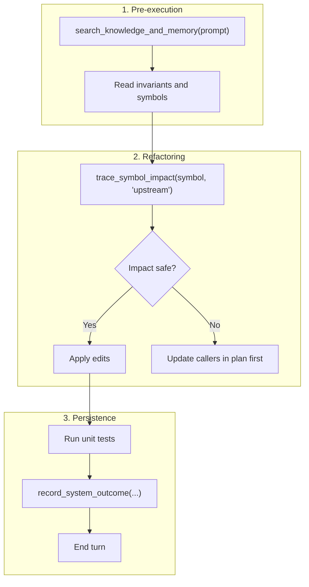

# FastMCP tools reference and protocols

This document details the parameter schemas, Cypher traversal paths, and operating protocols for the 7 Cortex FastMCP tools.

---

## 1. Tool overview

Cortex runs 7 tools over the Model Context Protocol (MCP) using stdio transport:

| Tool | Purpose | When to run |
| :--- | :--- | :--- |
| `search_knowledge_and_memory` | Four-tier parallel search | Before writing or editing code. |
| `trace_symbol_impact` | Symbol graph blast radius | Before renaming, deleting, or refactoring symbols. |
| `record_system_outcome` | Episodic memory persistence | After completing a non-trivial technical task. |
| `trigger_dream_mode` | Memory consolidation and clustering | On demand or at milestones. |
| `index_directory` | Hierarchical AST chunk indexing | When indexing a new directory into Qdrant. |
| `check_cortex_health` | System diagnostics | When tools time out or return empty outputs. |
| `delete_or_supersede_fact` | Fact invalidation | When architectural decisions change. |

---

## 2. Tool specifications

### `search_knowledge_and_memory`

Queries FalkorDB symbols, episodic facts, OpenViking signatures, and Qdrant vectors in parallel.

#### Parameters:
```json
{
  "prompt": {
    "type": "string",
    "description": "Natural language query or technical question.",
    "required": true
  },
  "collection": {
    "type": "string",
    "description": "Optional Qdrant collection override (defaults to cortex_codebase).",
    "required": false
  },
  "workspace_root": {
    "type": "string",
    "description": "Optional workspace path override for OpenViking context.",
    "required": false
  }
}
```

#### Output structure:
```markdown
### ── Tier 0: Symbols & Deterministic Graph ──
- Class: SymbolGraphManager (cortex/symbols/graph.py:12-250)
  - References: 14 incoming calls across 6 files
- Method: sync_file (cortex/viking/chunker.py:120-145)

### ── Tier 1: Operational Facts & Episodic Memory ──
- Fact [ep-20260919]: OpenViking watches intended project workspace dynamically via watcher.py.
- Invariant: All file edits must be validated against unit tests before committing.

### ── Tier 2: OpenViking Architecture Map ──
[Module boundaries, exported classes, and type signatures]

### ── Tier 3: Code & Docs References ──
[Top 5 cross-encoder reranked semantic code chunks]
```

---

### `trace_symbol_impact`

Traverses graph relationships to identify affected files before modifying code.

#### Parameters:
```json
{
  "symbol": {
    "type": "string",
    "description": "Name of the class, function, method, or interface to inspect.",
    "required": true
  },
  "direction": {
    "type": "string",
    "enum": ["upstream", "downstream"],
    "default": "upstream",
    "description": "'upstream' checks callers and dependents. 'downstream' checks dependencies."
  },
  "max_depth": {
    "type": "integer",
    "default": 3,
    "description": "Graph traversal hop limit (1 to 5)."
  },
  "symbols_graph": {
    "type": "string",
    "default": "cortex_symbols",
    "description": "FalkorDB symbol graph name."
  }
}
```

#### Graph traversals:
- **`upstream`**:
  `MATCH (caller)-[:REFERENCES|CALLS|IMPORTS*1..3]->(target:Symbol {name: $symbol}) RETURN caller, path`
  Finds callers and modules that import this symbol.
- **`downstream`**:
  `MATCH (target:Symbol {name: $symbol})-[:REFERENCES|CALLS|IMPORTS*1..3]->(dep) RETURN dep, path`
  Finds helper functions and external symbols this symbol calls.

---

### `record_system_outcome`

Writes decisions, bug fixes, or architectural choices to the FalkorDB episodic graph and appends them to the daily markdown journal.

#### Parameters:
```json
{
  "episode_name": {
    "type": "string",
    "description": "Short descriptive summary title (5 to 10 words).",
    "required": true
  },
  "content": {
    "type": "string",
    "description": "Detailed description of the change, decisions made, and rationale.",
    "required": true
  },
  "tags": {
    "type": "array",
    "items": { "type": "string" },
    "description": "Lowercase keyword tags, e.g. ['viking', 'watcher', 'refactor']"
  },
  "project": {
    "type": "string",
    "default": "cortex",
    "description": "Project identifier label."
  },
  "entities": {
    "type": "array",
    "items": {
      "type": "object",
      "properties": {
        "name": { "type": "string" },
        "type": { "type": "string" },
        "summary": { "type": "string" }
      }
    }
  },
  "facts": {
    "type": "array",
    "items": {
      "type": "object",
      "properties": {
        "source": { "type": "string" },
        "relation": { "type": "string" },
        "target": { "type": "string" },
        "fact": { "type": "string" }
      }
    }
  },
  "supersedes": {
    "type": "array",
    "items": { "type": "string" },
    "description": "List of pattern strings superseded by this outcome."
  }
}
```

---

### `trigger_dream_mode`

Runs the memory consolidation cycle:
1. Prunes superseded facts.
2. Runs Louvain graph community detection to map codebase subsystems.
3. Derives architectural rules and writes them to `journal/invariants.md`.
4. Saves a dated report to `journal/dreams/`.

#### Parameters:
```json
{
  "project": {
    "type": "string",
    "default": "cortex"
  },
  "purge_stale": {
    "type": "boolean",
    "default": false,
    "description": "If true, permanently drops superseded fact nodes from the graph."
  }
}
```

---

### `index_directory`

Parses source code in a folder into hierarchical AST chunks and stores them in Qdrant.

#### Parameters:
```json
{
  "path": {
    "type": "string",
    "description": "Absolute path to directory to index.",
    "required": true
  },
  "collection": {
    "type": "string",
    "default": "cortex_codebase",
    "description": "Target Qdrant collection name."
  },
  "exclude_patterns": {
    "type": "array",
    "items": { "type": "string" },
    "description": "Glob patterns to ignore (e.g. ['.git/*', '*.pyc', 'node_modules/*'])"
  }
}
```

---

### `check_cortex_health`

Tests connectivity to all configured services:
- FalkorDB (port 6379)
- Qdrant (port 6333)
- Inference server (configured `EMBED_BASE_URL`)
- Dashboard (port 8004)

---

### `delete_or_supersede_fact`

Marks a single fact node in the episodic graph as invalid.

#### Parameters:
```json
{
  "fact_id": {
    "type": "string",
    "description": "Unique identifier of the fact node in FalkorDB.",
    "required": true
  },
  "reason": {
    "type": "string",
    "description": "Technical reason for invalidating this fact.",
    "required": true
  }
}
```

---

## 3. Agent operating protocols

Agents follow three standard workflows:



1. **Pre-execution**: Call `search_knowledge_and_memory` before modifying files or creating plans.
2. **Blast-radius inspection**: Call `trace_symbol_impact` before altering signatures of shared functions or classes.
3. **Outcome persistence**: Call `record_system_outcome` upon completing a task. The `Stop` lifecycle hook stops the turn from exiting if files were changed without recording an outcome.
