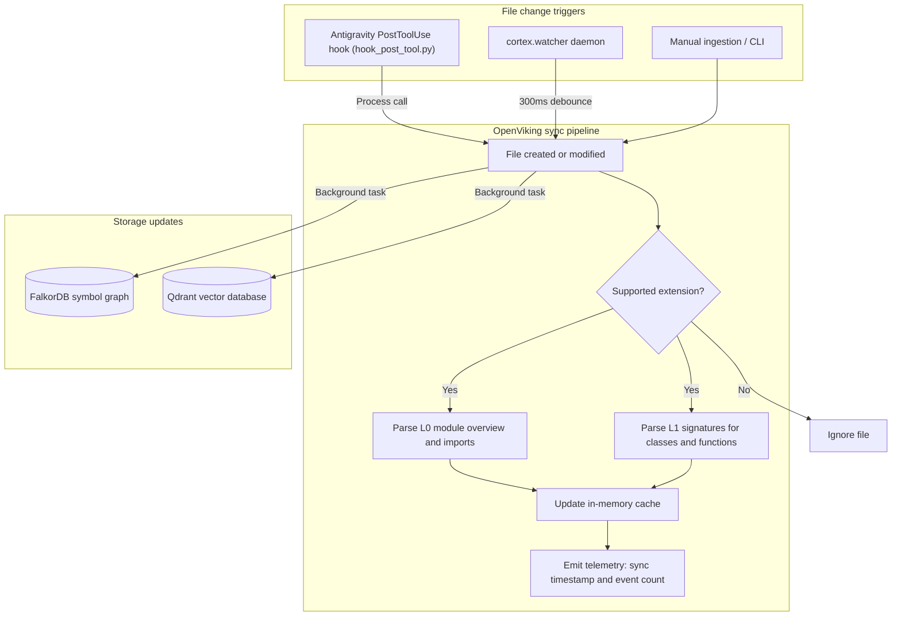

# OpenViking dynamic watching and real-time sync

This document covers OpenViking's dynamic code parser, file watching mechanism, sub-5ms AST synchronization, and memory caching.

---

## 1. Overview

OpenViking (`cortex/viking/chunker.py`) maintains an in-memory structural view of the active codebase:
- **Incremental file sync (`sync_file`)**: Parses L0 module overviews and L1 signatures into memory in under 5ms on file change.
- **Incremental cache eviction (`delete_file`)**: Removes deleted files from memory immediately.
- **Language support**: Handles 10 languages including Python, TypeScript, Rust, Go, C, C++, Java, Kotlin, Swift, and C#.
- **Workspace switching (`set_active_workspace`)**: Switches base directories without restarting the process.

---

## 2. Dynamic synchronization flow



---

## 3. Key methods in `VikingChunker`

### `sync_file(file_path: str) -> None`
Parses and updates L0 and L1 context for a single changed file:
```python
viking.sync_file("cortex/server.py")
```
- Runs AST extraction only on the target file (taking 1 to 5ms).
- Updates `self._file_signatures` and `self._module_summaries`.
- Avoids rescanning unchanged files.

### `delete_file(file_path: str) -> None`
Evicts cached signatures when a file is removed:
```python
viking.delete_file("cortex/old_module.py")
```
- Removes entries from internal dictionaries.
- Cleans up corresponding vectors and graph nodes.

### `set_active_workspace(workspace_root: str) -> None`
Switches the base directory:
```python
viking.set_active_workspace("/path/to/other-project")
```
- Re-points relative path calculations to the new root.

### `get_context_for_query(query: str, max_tokens: int = 1500) -> str`
Formats the Tier 2 code structure block:
- Selects relevant module summaries and function signatures.
- Formats them as markdown for prompt injection.

---

## 4. File watcher daemon (`cortex/watcher.py`)

The file watcher runs as a background process or Antigravity sidecar:
- **Event listening**: Uses native OS events via the `watchdog` library (`FSEvents` on macOS, `inotify` on Linux).
- **Debounce**: A 300ms debounce window groups rapid writes into a single sync pass.
- **Exclusions**: Ignores `.git/`, `__pycache__/`, `.venv/`, `node_modules/`, `data/`, and `logs/`.
- **Status API**: Exposes status, event counts, and timestamps through `/api/watcher/status` on the dashboard.
